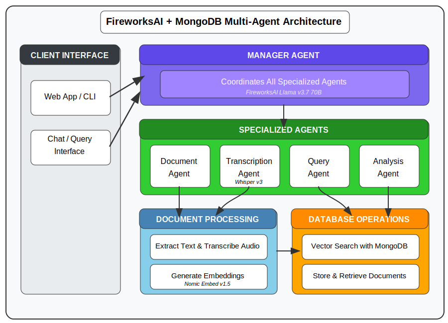

# EarningsAI Multi-Agent Analysis System

This enhanced version of EarningsAI leverages a multi-agent architecture to provide more powerful and flexible analysis of financial documents and earnings calls.

## Table of Contents
- [Overview](#overview)
- [Multi-Agent Architecture](#multi-agent-architecture)
- [Agent Types](#agent-types)
- [Key Advantages](#key-advantages)
- [Installation](#installation)
- [Usage](#usage)
- [Examples](#examples)
- [Customization](#customization)

## Overview

The EarningsAI Multi-Agent System transforms the original pipeline-based implementation into a coordinated team of specialized AI agents. This approach allows for more sophisticated analysis, parallel processing, and a more flexible workflow that adapts to different types of financial documents and queries.

## Multi-Agent Architecture

<div align="center">
  
  <p><em>Architecture diagram showing the coordinated system of specialized agents working together with MongoDB Atlas</em></p>
</div>

Our multi-agent system consists of:

1. **Manager Agent** - Coordinates workflow between specialized agents
2. **Document Agent** - Processes document files
3. **Transcription Agent** - Handles audio file transcription
4. **Query Agent** - Retrieves relevant information from the database
5. **Analysis Agent** - Performs financial analysis on retrieved information

The Manager Agent intelligently delegates tasks, maintains context, and oversees the entire workflow, ensuring that each specialized agent is used appropriately.

## Agent Types

### 1. Document Agent
- Extracts text from PDF, DOCX, and TXT files
- Processes entire directories of documents
- Stores documents with appropriate metadata

### 2. Transcription Agent
- Transcribes audio files from earnings calls
- Handles different audio formats
- Automatically stores transcriptions in the database

### 3. Query Agent
- Retrieves relevant documents using vector search
- Filters results by company, date range, and document type
- Combines information from multiple sources

### 4. Analysis Agent
- Extracts key financial metrics (revenue, EPS, margins)
- Identifies business trends and investment areas
- Summarizes earnings calls into concise bullet points

### 5. Manager Agent
- Coordinates workflow between specialized agents
- Maintains context across the entire analysis process
- Makes decisions about which processing steps to take

## Key Advantages

### 1. Specialized Expertise
Each agent is optimized for a specific task, allowing for more sophisticated analysis in each domain.

### 2. Parallel Processing
Multiple agents can work simultaneously on different aspects of the task, improving efficiency.

### 3. Contextual Intelligence
The Manager Agent maintains a unified view of the entire process, making connections between different documents and analyses.

### 4. Enhanced Analysis
The dedicated Analysis Agent can perform specialized financial analysis that wasn't possible in the pipeline approach.

### 5. Adaptability
The system can adjust its workflow based on the specific requirements of each query, skipping unnecessary steps.

### 6. Improved Error Handling
If one agent encounters issues, others can continue their work, making the system more robust.

## Installation

```bash
# Clone the repository
git clone https://github.com/shubcodes/earnings-ai-demo.git
cd earnings-ai-demo

# Create and activate a virtual environment
python -m venv .venv
source .venv/bin/activate  # On Windows: .venv\Scripts\activate

# Install dependencies
pip install -r requirements.txt
```

## Usage

### Command Line Interface

```bash
# Process documents and audio files with the multi-agent system
python earnings_ai_demo/earnings_ai_demo/main.py
```

### Web Interface

```bash
# Start the Streamlit app
streamlit run earnings_ai_demo/earnings_ai_demo/app.py
```

## Examples

### 1. Financial Metrics Analysis

```python
from earnings_ai_demo.agent_system import FinancialAnalysisSystem

# Initialize the system
analysis_system = FinancialAnalysisSystem(
    api_key="your_fireworks_api_key",
    mongodb_uri="your_mongodb_uri"
)

# Process documents and extract metrics
result = await analysis_system.process_financial_data(
    query="What are the key financial metrics from Q3 2023?",
    files=["quarterly_report.pdf", "earnings_call.mp3"],
    company_ticker="MDB"
)

print(result)
```

### 2. Investment Strategy Analysis

```python
# Analyze strategic investments and market conditions
result = await analysis_system.process_financial_data(
    query="Analyze MongoDB's AI investment strategy and how it positions them in the market",
    files=["investor_presentation.pdf", "earnings_transcript.txt"],
    company_ticker="MDB"
)
```

### 3. Comparative Analysis

```python
# Compare performance across quarters
result = await analysis_system.process_financial_data(
    query="Compare revenue growth in Q2 vs Q3 and explain key factors",
    files=["q2_report.pdf", "q3_report.pdf"],
    company_ticker="MDB",
    date_range=["2023-04-01", "2023-09-30"]
)
```

## Customization

The multi-agent system is designed to be customizable:

### Adding New Agent Types

```python
def _create_custom_agent(self):
    """Create a custom agent for specific analysis"""
    
    @tool
    def custom_analysis(documents: List[Dict]) -> Dict:
        # Custom analysis logic
        return {"result": analysis_output}
    
    return ToolCallingAgent(
        tools=[custom_analysis],
        model=self.model,
        max_iterations=10
    )
```

### Modifying the System Prompt

You can adjust the Manager Agent's behavior by modifying its system prompt in the FinancialAnalysisSystem class:

```python
self.manager = CodeAgent(
    tools=[],
    system_prompt="""Your custom instructions for coordinating the agents.
    Use all relevant agents to accomplish the task, with focus on:
    1. Priority areas for your specific use case
    2. Special handling for your document types
    3. Custom analysis approaches
    """,
    model=self.model,
    managed_agents=self.managed_agents
)
```

### Using Different LLM Providers

The system uses LiteLLM, which makes it easy to switch between different LLM providers:

```python
# Use OpenAI
analysis_system = FinancialAnalysisSystem(
    api_key="your_openai_key",
    mongodb_uri="your_mongodb_uri",
    model_id="gpt-4"
)

# Use Anthropic
analysis_system = FinancialAnalysisSystem(
    api_key="your_anthropic_key",
    mongodb_uri="your_mongodb_uri",
    model_id="claude-3-opus-20240229"
)
```

---

This enhanced multi-agent architecture transforms EarningsAI from a simple document processor into an intelligent analysis system that can handle complex financial queries and provide deeper insights.
